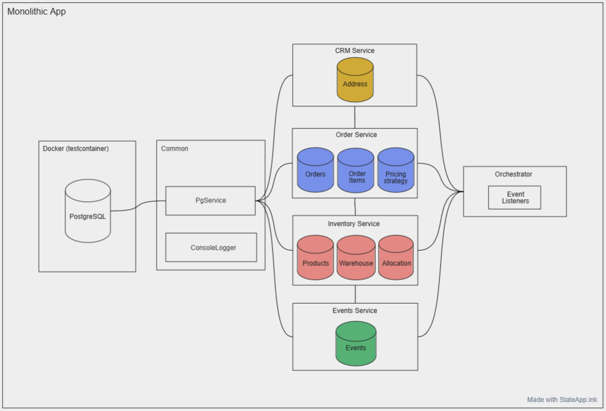

# Name & Shame

This project was developed as part of a tech interview by [ScreenCloud](https://screencloud.com/).

It took me a week to develop, while I was fighting the after-effects of long-covid, and a severe teeth infection.
After finishing this project, the HR initially praised it and asked for further rounds of interview.
However, before setting up the said next round, I was informed that they had "moved forward with another candidate".

Do not accept take-home projects as part of your interviews. They are a way to make you work for free. Lesson learnt.

Feel free to use this code however you like.

# ScreenCloud OMS DEMO
Author: Soumik Chatterjee (soumik.chat@hotmail.com)

## MVP Features

### Functional requirements

- [x] Products, warehouses, and inventory models.
- [x] Preview and verify order before confirming.
- [x] Customizable shipping strategy.
- [x] Customizable Pricing & promotional strategy.
- [x] Order pricing & stock allocation validation.
- [x] Clear pricing breakdown for each order.
- [x] Transaction inventory manipulation.

### Tech requirements

- [x] Typescript + Node solution!
- [x] PostgreSQL Database for storage!
- [x] Well-documented APIs through Swagger.io!
- [x] Testing strategy with docker + containerized DB instance!
- [x] Simple & no usage of any opinionated frameworks!
- [x] Production grade architecture - extensible, scalable, consistent, performant!
- [x] Dev scripts for running in local environment!

## Installation

### Prerequisites

Before setting up the project, ensure you have the following installed:

- **Docker**: This application uses dockerized PostgreSQL as its primary database.
- **Node.js**: Version `v20.11.0` or higher.
- **npm**: Main packagae manager.

### Steps

1. Clone the repository to your local machine.
2. Navigate to the project directory.
3. Install dependencies:
    ```bash
    npm install
    ```
4. Ensure Docker is running.
5. Start the development server:
    ```bash
    npm run dev
    ```
6. The REST API endpoint is '<http://localhost:3000>'. The docs for the API can be found on the swagger link '<http://localhost:3000/swagger>'.

## Project

### Directory structure

This project is designed to be modular and scalable, with a focus on separating concerns and ensuring services are loosely coupled.The project is organized into the following main directories:

- **`common/`**: Contains shared utilities, constants, and helper functions used across the project.
  - **`types/`**: Interface to services, to be used by other microservices.
  - **`lib/`**: Helper and utility.
  - **`..others`**: Service implementations which can be used by all other services.
- **`services/`**: Houses individual microservices, each responsible for a specific domain.
- **`app/`**: Contains the main application logic and entry points.
- **`dev/`**: Integration tests and shared test-setup script.

Items which are defined in `common` directory can be imported and used by all others. Items defined in the `services` folder cannot import from other items defined in the `services` folder, hence maintaining a separation of concerns. In a nutshell, the following import logic is implemented:

- App -> can import from `services` and `common`.
- Services -> can import from `common`.
- Common -> can import from `common`.

### Services



While the project is monolithic, its architecture is kept so that it can be converted into microservice based architecture easily by creating `package.json` for each individual service.

- **CRM**: Interface to a third-party CRM which primarily keeps track of customer id associations and shipping addresses.

- **Inventory**: Handles inventory management, including stock quantity, product availability, and warehouse operations. Keeps record of stock allocations for order service.

- **Order**: Manages all operations related to customer orders, including order creation, updates, and fulfillment. It ensures that orders are validated correctly and integrates with the inventory systems. The order service implements a strategy pattern - allowing multiple pricing, ptomotional, inventory allocation, and validation logic to be used interchangably as required for an order.

- **Orchestrator**: Acts as the central coordinator for the system, managing communication between services. The orchestrator operates on a Saga coordination pattern, and takes over the flow of events after the order has been finalized. It can be used to seamlessly integrate payment, or other tasks in between the existing workflow. More events can be added to implement recovery/rollback/retry mechanisms.

- **Event**: Responsible for event-driven communication within the system. It manages the publishing, subscription, and delivery of event. It inplements the 'Only one and always one' delivery principle. It enabling decoupled interactions between services, especially between services and the orchestrator.

- **Logger**: Provides centralized logging for the system. This provides a simple interface to all loggin, and can be swapped out for better alternatives such as Winston or sentry, without modifying the services themselves. Internally, this demo app uses the standard console for logging.

- **WebServer**: The webserver exposes a REST API that the user to access all the services in the project.It is meant to handle the authentication logic. Additionally, the webserver hosts the Swagger UI.

- **PgService**: PostgreSQL is used as the primary database for all customer, order, inventory and product data. It is chosen for its transactional capabilities and atomic operations that are capable of rollback on failure. PG is also used as the data layer for the Event service, by polling mechanism.

## Testing

For demo purpose, only one integration currently exists in the `src/dev/oms.integration.test.ts` file. Unit tests are not provided.

## Phase 2 Proposal (Tech KPIs only)

- [ ] Add CI/CD - Husky, docker compose!
- [ ] Add dependency injection - TSyringe / Inversify
- [ ] Add query builder - Kysely
- [ ] Streamline error handling
- [ ] Add event & error monitoring - Grafana, Sentry
- [ ] Add database view - Metabase
- [ ] Increase test coverage
